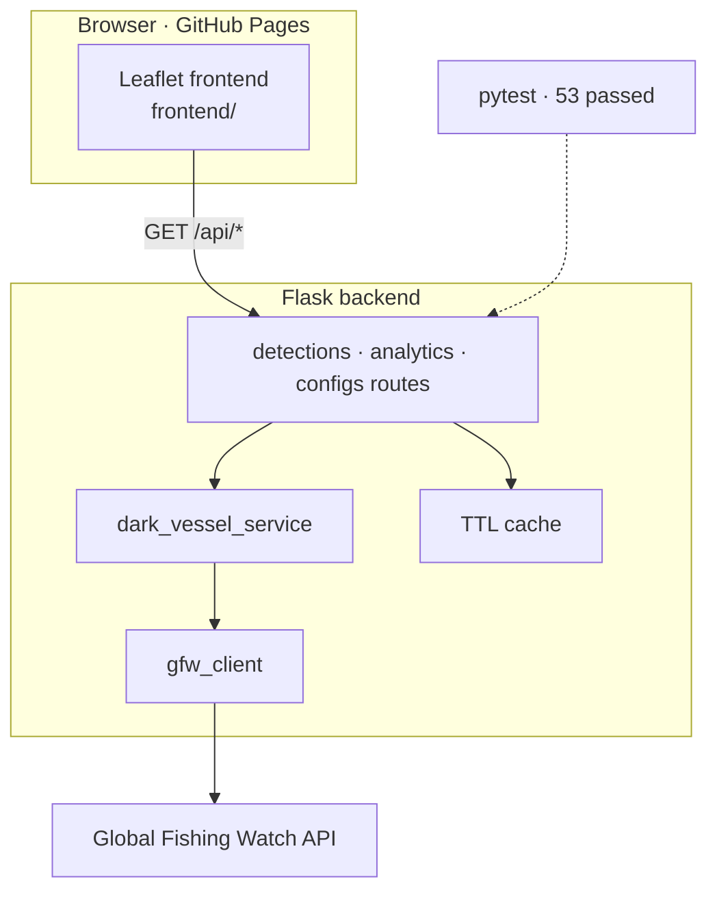
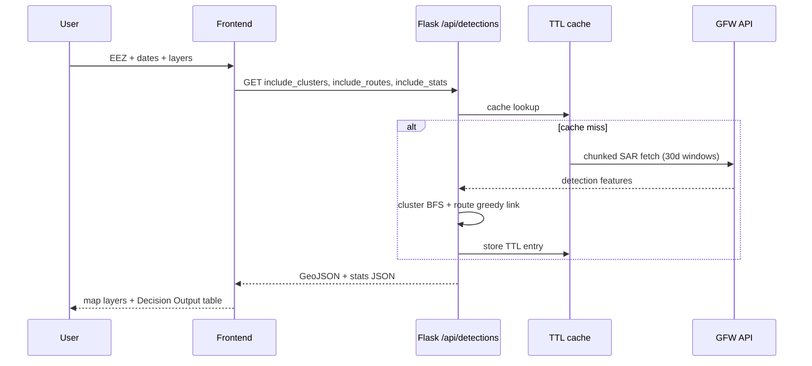

# Maritime Surveillance

Explore potential non-cooperative maritime patterns using Global Fishing Watch SAR detections, with proximity clustering and best-effort route inference.

**Live demo:** `https://charlotteprevost.github.io/maritime_surveillance/`  
**Repo:** `https://github.com/charlotteprevost/maritime_surveillance`

## Portfolio quick view

### Demo flow (recruiter / LinkedIn walkthrough)

| Step | Time | Action | What to highlight |
|------|------|--------|-------------------|
| 1 | 5–8s | Open live demo landing | SAR map + EEZ context; “screening, not proof” |
| 2 | 10–15s | Click **Try a demo** | Preset EEZ, date range, layers applied |
| 3 | 10–15s | Toggle clusters + routes | Proximity heuristic + one analytics metric |
| 4 | 8–12s | **Decision Output** panel | Preview table → export GeoJSON or CSV |
| 5 | 8–12s | Mention engineering | Flask API, TTL cache, pytest, GitHub Pages deploy |
| 6 | 5s | CTA | Live URL + GitHub + this README |

### System architecture



### Request path (one query)



### Stack & reliability

| Layer | Technology | Notes |
|-------|------------|-------|
| Frontend | Leaflet, vanilla JS, marker clustering | Static bundle in `frontend/` → `docs/` for Pages |
| Backend | Flask, modular routes | Token stays server-side |
| Data | GFW SAR presence + EEZ config | 30-day fetch chunking for long ranges |
| Cache | In-memory TTL (`ttl_cache.py`) | Detections 5m · config 1h · EEZ 24h |
| Tests | pytest | `53 passed, 6 skipped` locally |
| Deploy | GitHub Pages + optional API host | `./scripts/sync_docs.sh` |

### Screenshots (optional)


- API-first design: static frontend + Flask backend; GFW token server-side only.
- Expensive routes cache-backed (`/api/detections`, `/api/bins`, analytics helpers).
- Live GFW health tests optional: `GFW_API_HEALTH=1` + token.

## 1) Purpose

This app helps you visually inspect maritime areas for suspicious patterns where vessels may not be broadcasting identity (AIS).

What you can do:

- Select one or more EEZs (Exclusive Economic Zones) and a date range.
- View SAR detections (Synthetic Aperture Radar "hits" from satellites).
- Toggle derived layers:
  - proximity clusters (possible rendezvous/transshipment patterns)
  - predicted routes (best-effort movement links between detections)
- See summary stats quickly in the map interface.
- Export current detections, clusters, or routes as GeoJSON/CSV from the in-map "Decision Output" panel.

Important interpretation notes:

- SAR detections are **location** events, not confirmed vessel identities.
- "Dark traffic", clusters, and routes are **heuristics for screening and triage, not legal proof.**

## 2) Developer guide (run it yourself)

### Prerequisites

- Python 3.10+ recommended
- A Global Fishing Watch [API token](https://globalfishingwatch.org/our-apis/documentation#quick-start) (`GFW_API_TOKEN`)

### Backend

```bash
cd backend                             # enter backend service folder
pip install -r requirements.txt       # install backend dependencies
export GFW_API_TOKEN="..."            # set your Global Fishing Watch API token
export FRONTEND_ORIGINS="http://localhost:8080"  # allow local frontend origin for CORS
python app.py                         # start backend API server
```

### Frontend

```bash
cd frontend                   # enter frontend static app folder
python -m http.server 8080    # serve frontend locally on port 8080
```

Open: `http://localhost:8080`

### Decision output exports (Shot-4 ready)

After running a query, use the bottom-left `Decision Output` panel:

- Select dataset: `SAR detections`, `Dark traffic clusters`, or `Predicted routes`.
- Preview the first records in the mini table.
- Export either `GeoJSON` (EPSG:4326 lon/lat) or `CSV` for downstream analysis/reporting.

### Tests

```bash
cd backend    # run tests from backend folder
pytest -q     # execute test suite (quiet output; --strict-markers is enabled via pytest.ini)
```

Before publishing, also verify `docs/` matches `frontend/`:

```bash
cd backend
REQUIRE_DOCS_SYNC=1 pytest -q
```

**Live GFW API health** (integration; hits `gateway.api.globalfishingwatch.org`):

```bash
cd backend
export GFW_API_TOKEN="..."   # or: set -a && source ../.env && set +a
export GFW_API_HEALTH=1
pytest -m gfw_health -v tests/test_gfw_api_health.py
```

From repo root: `python3 scripts/gfw_api_probe.py` (loads `.env`, sets `GFW_API_HEALTH=1`, runs the same tests).

### Public deploy (GitHub Pages from `docs/`)

- Source app: `frontend/`
- Published bundle: `docs/`

```bash
./scripts/sync_docs.sh                         # copy frontend publish assets into docs/
pytest -q                                      # run tests before publishing
git add docs                                   # stage updated docs bundle
git commit -m "docs: sync publish bundle"      # commit docs-only publish update
git push origin main                           # push so GitHub Pages can deploy
```

### Performance notes

- **Date-range chunking (backend):** SAR/event fetches are split into 30-day chunks in `backend/services/dark_vessel_service.py` to reduce timeout/rate-limit failures on long windows.
- **Summary chunking (detections route):** `GET /api/detections` applies 365-day summary chunking when date windows exceed API limits.
- **Batch API strategy:** frontend calls a single `GET /api/detections` request with `include_clusters`, `include_routes`, and `include_stats` flags to avoid redundant round trips.
- **Dynamic client timeout:** frontend timeout scales with workload (`base + chunk + EEZ + batch overhead`) and surfaces actionable timeout guidance when requests are too broad.
- **User feedback during heavy loads:** loading UI reports estimated chunks and ETA; requests are cancellable via `AbortController`.
- **Server-side TTL cache:** routes use in-memory TTL caching (`backend/utils/ttl_cache.py`) with configurable defaults:
  - `MS_CACHE_ENABLED` (default true)
  - `MS_CACHE_DEFAULT_TTL_SECONDS` (default 300)
  - `MS_CACHE_MAX_ITEMS` (default 512)
- **Longer-lived stable cache entries:** config and EEZ boundary routes use longer TTLs (1h and 24h) due low data volatility.
- **Frontend map rendering:** Leaflet marker clustering (`chunkedLoading`) and layer toggles prevent rendering overload on dense detections.

### Security notes

- **Token handling:** `GFW_API_TOKEN` is consumed only by the backend; frontend never needs direct GFW credentials.
- **Authenticated upstream calls:** backend injects `Authorization: Bearer <token>` for GFW requests in `backend/utils/gfw_client.py` and tile proxy routes.
- **Tile proxy pattern:** frontend requests map tiles through `/api/tiles/proxy/*`; this keeps upstream credentials server-side.
- **CORS control:** `FRONTEND_ORIGINS` defines allowed browser origins. Default local behavior is permissive for development, but production should be origin-restricted.
- **No secret-in-repo policy:** keep `.env` local; commit only `.env.example` and deployment env configuration.
- **Operational checks:** use `/healthz` and `/api/health` for deploy-time validation before exposing the app publicly.
- **Risk framing:** outputs are heuristic decision support (not proof), reducing misuse risk through explicit interpretation guidance in UI and docs.

## 3) Sources, methods, and math (full reference)

### Data and service sources

- Global Fishing Watch API (authenticated), including:
  - `public-global-sar-presence:latest`
  - event/insight endpoints used by backend routes
- OpenStreetMap basemap tiles (Leaflet base layer)
- EEZ boundary/config data exposed through backend config endpoints

### External references used in method design

- Global Fishing Watch SAR dataset documentation:
  - `https://globalfishingwatch.org/data-download/datasets/public-global-sar-presence`
- Sentinel-1 mission and revisit characteristics:
  - `https://sentinel.esa.int/web/sentinel/missions/sentinel-1`
- Maritime speed context:
  - International Maritime Organization (SOLAS context for typical vessel speeds)
- Related tracking literature:
  - Kroodsma et al. (2018), *Science* 359(6378), 904-908
- Additional risk-threshold rationale (repo-local):
  - `DARK_TRADE_RISK_THRESHOLDS.md`

### Core assumptions

- SAR points may be unmatched to AIS and generally do not include vessel identity.
- Long date ranges are chunked (30-day chunks) to reduce API timeout/rate-limit risk.
- Clusters are same-date by default to reduce false positives from unrelated detections.
- Route inference is greedy and proximity-based; it is exploratory, not deterministic tracking.

### Math used in the app

1. Great-circle distance (Haversine)

- Used for proximity checks and route segment distances.
- Earth radius R = 6371 km.

a = \sin^2\left(\frac{\Delta \phi}{2}\right) + \cos(\phi_1)\cos(\phi_2)\sin^2\left(\frac{\Delta \lambda}{2}\right)

c = 2\arctan2(\sqrt{a}, \sqrt{1-a})

d = R \cdot c

1. Proximity clustering (graph connected components)

- Two detections are considered neighbors if distance \le `max_distance_km` (default 5 km).
- With `same_date_only=true`, clustering is run per date bucket.
- Clusters are connected components discovered via breadth-first search.

1. Cluster risk indicator (heuristic)

- Let `vessel_count` be the sum of detection counts in a cluster.
- `high` if `vessel_count >= 3`
- `medium` if `vessel_count >= 2`
- else `low`

1. Route linking score (greedy next-point selection)

- Candidate points must satisfy:
  - distance \le `max_distance_km_route` (default 100 km)
  - forward time difference \le `max_time_hours` (default 48 h)
- Candidate score:

score = \frac{1}{1 + distance*{km}} \times \frac{1}{1 + \Delta t*{hours}}

- Best-scoring candidate is selected iteratively.

1. Route confidence (heuristic)

- Base confidence:

confidence = \min\left(\frac{\text{pointcount}}{10}, 1.0\right)

- Speed penalty using average speed:
  - full weight if 5 \le v{km/h} \le 60
  - \times 0.8 if v < 5
  - \times 0.6 if v > 60

1. Route aggregates

- Total route distance = sum of consecutive Haversine segment distances.
- Duration = time difference between first and last point.

### Known limitations

- No vessel identity in many SAR detections.
- Clusters/routes can include false positives/negatives.
- Outputs are for decision support and exploratory analysis, not adjudication.

## API quick reference

### Config / health

- `GET /healthz`
- `GET /api/health`
- `GET /api/configs`

### Core detections

- `GET /api/detections`
- `GET /api/detections/proximity-clusters`
- `GET /api/detections/routes`
- `GET /api/detections/sar-ais-association`
- `GET /api/tiles/proxy/<path>`

### Analytics / events / vessels

- `GET /api/analytics/dark-vessels`
- `GET /api/analytics/risk-score/<vessel_id>`
- `GET /api/events`
- `GET /api/vessels/<vessel_id>`
- `GET /api/vessels/<vessel_id>/timeline`
- `POST /api/insights`

### Legend helper

- `GET /api/bins/<zoom_level>`

